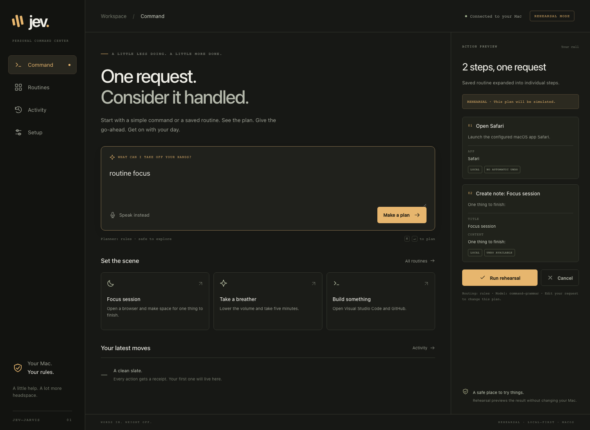
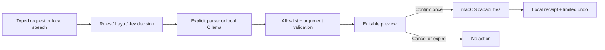

<div align="center">

# JEV / JARVIS

### Your Mac. A few words. A little superpower.

A voice-ready command companion for macOS.\
**Say what you want → rehearse the plan → make it happen.**

[](https://github.com/RaghavGarg1210/jev-jarvis/actions/workflows/checks.yml)
[](https://www.python.org/)
[](https://support.apple.com/macos)
[](LICENSE)

[Get started](#get-started) · [What it does](#what-it-does) · [Local AI](#give-it-a-local-brain) · [How it works](#small-brain-clear-boundaries) · [Research](docs/RESEARCH.md)

</div>



Most laptop assistants start with a chat box and a promise to do everything. Jarvis starts with **a plan you can inspect**. Apps, notes, messages, timers, and your own Shortcuts become small, explicit capabilities. Local **Laya** or optional hosted **Jev** makes bounded decisions; ordinary code checks and carries out the actions.

The fun part is turning little rituals into a single request. “Routine focus” opens Safari and creates a fresh focus note. “Routine reset” lowers the volume and starts a five-minute breather. Make your own for a study sprint, a morning setup, or getting ready to build.

## Get started

Python 3.11+; macOS for real laptop actions. Python 3.12 is a good choice for the optional model packages. Rehearsal works on macOS, Linux, and Windows.

```bash
git clone https://github.com/RaghavGarg1210/jev-jarvis.git
cd jev-jarvis
python3 -m venv .venv
source .venv/bin/activate
python -m pip install -e .
jev-jarvis
```

Your browser opens at **http://127.0.0.1:8765**. No API key, model download, or frontend build is needed. You can also run `python -m jarvis` directly from the checkout.

Start with `open Safari` or choose a routine. **Rehearsal is the default**: the plan and receipt are real, but laptop effects are simulated. To enable actual actions, stop the server and launch:

```bash
jev-jarvis --live
```

Every plan still needs an explicit confirmation. Mode is fixed when the server starts. `--no-browser`, `--port 8766`, `--state-dir /path/to/state`, and `--config /path/to/config.json` are available; see `jev-jarvis --help`.

## What it does

| Say or type | What happens after approval in live mode |
|---|---|
| `open Safari` | Launch a configured app |
| `open https://github.com` | Open a web page in your browser |
| `search for northern lights` | Search DuckDuckGo |
| `note Weekend: Find a new trail` | Save a Markdown note locally |
| `timer for 25 minutes` | Start a countdown in the workspace |
| `volume 30` | Set your Mac’s output volume |
| `say Welcome back, captain` | Speak through macOS text-to-speech |
| `message alex: I'll be there in ten` | Preview and send an iMessage to a configured contact |
| `routine focus` | Expand a reusable routine into individual steps |
| `shortcut meeting` | Run a Shortcut you explicitly configured |

The built-in command grammar handles these forms without a model. Optional **Ollama** handles more flexible phrasing and multi-step requests. Unknown apps, missing contacts, unsupported actions, and conflicting model decisions produce a useful error instead of a guess.

### Three things that make it feel different

**Rehearsal before reality.** Try an idea without opening apps or sending anything. A preview shows the exact destination and message, each routine step, and which provider interpreted it. Editing makes a new plan; approvals expire after five minutes and can be used only once.

**Routines with a little personality.** Focus session, Take a breather, and Build something are included. Routines use the same previews and capability checks as individual requests. They’re JSON you can read and change, not hidden agent instructions.

**Receipts instead of mystery.** Activity shows what ran, what failed, and where a routine stopped. Undo cancels a timer or removes an unchanged note Jarvis created. A note you edited is preserved. Messages, app launches, URLs, volume changes, and Shortcuts have no claimed undo.

## Give it a local brain

The two model roles are separate:

| Component | Job | Where it runs |
|---|---|---|
| Built-in rules | Explicit command parsing; no inference | Your Mac, zero dependencies |
| **Laya** | Choose a typed intent from supported actions | Your Mac, after downloading weights |
| **Jev** | Optional hosted typed intent decision | TypeSafe API, only when selected |
| **Ollama** | Optional structured planning for paraphrases | Local Ollama server |
| **faster-whisper** | Optional press-to-talk transcription | Your Mac, after downloading weights |

**Laya is an independent open-source alternative to Jev, not an offline release of Jev.** Both make decisions rather than generate prose. A confidence value is a model score, never permission to run an action. The default rules mode is labeled honestly; it does not pretend to be AI.

Local decisions:

```bash
python -m pip install -e '.[laya]'
JARVIS_DECIDER=laya jev-jarvis
```

Local natural-language planning, with [Ollama](https://ollama.com/) installed and running:

```bash
ollama pull qwen3:4b
JARVIS_DECIDER=laya JARVIS_PLANNER=ollama jev-jarvis
```

Or opt into hosted Jev:

```bash
export TYPESAFE_API_KEY='your-key'
JARVIS_DECIDER=jev jev-jarvis
```

No silent cloud fallback. Selecting Jev sends the request text to TypeSafe; selecting Laya keeps decision inference local. See the [provider guide](docs/PROVIDERS.md) for setup, context limits, environment variables, and troubleshooting.

### Talk to it

```bash
python -m pip install -e '.[voice]'
JARVIS_VOICE=1 jev-jarvis
```

Click the microphone, speak, and click again to stop. Recording stops at 30 seconds. Local Whisper fills the composer; you can fix the transcript before planning. There is no background listening or browser cloud speech service. The first transcription may take longer while the model downloads. Microphone permission is controlled by your browser; install the optional voice dependencies in the same virtual environment.

## Make it yours

Copy the example and edit it:

```bash
mkdir -p ~/.jev-jarvis
cp examples/config.json ~/.jev-jarvis/config.json
```

Restart Jarvis after changing configuration. Aliases use lowercase letters, numbers, spaces, `_`, or `-`.

```json
{
  "apps": {"code": "Visual Studio Code"},
  "contacts": {"alex": "+15555550123"},
  "shortcuts": {
    "meeting": {
      "name": "Meeting prep",
      "description": "Run my Meeting prep Shortcut, which opens my meeting apps."
    }
  },
  "scenes": {
    "study": {
      "title": "Study sprint",
      "description": "A clean note and 25 minutes to think.",
      "steps": [
        {"kind": "create_note", "args": {"title": "Study sprint", "content": "Today's question:"}},
        {"kind": "timer", "args": {"seconds": 1500, "label": "Study sprint"}}
      ]
    }
  }
}
```

Replace the example contact with a real destination you intend to use; no contacts ship enabled. Then try `message alex: On my way` or `routine study`. iMessage needs a signed-in Messages app and macOS Automation permission. A successful receipt means macOS accepted the send command, not proof that the recipient received it.

Create the Shortcut in Apple’s Shortcuts app first. Its description should accurately describe its effects; Jarvis cannot inspect or undo a Shortcut’s internals. This is the extension point for your existing automations.

## Small brain, clear boundaries



The browser never sends executable code. Confirmation carries only a stored plan ID, and the server executes its own immutable copy. Native integrations use fixed argument lists and fixed AppleScripts; message content remains data. The server binds to loopback, validates Host/Origin, and requires a per-process token on every mutation.

The core uses Python’s standard library and plain browser JavaScript. Model and speech dependencies are optional so you can understand and run the project before installing a model stack.

```text
jarvis/
  planner.py       command grammar and optional planning
  providers.py     typed Jev/Laya decisions and Ollama transport
  actions.py       validated macOS capabilities and note undo
  engine.py        expiring plans, execution, and receipts
  server.py        local HTTP boundary
  speech.py        optional local transcription
  static/          command workspace
```

## Privacy and practical limits

- No telemetry or external frontend assets. Model downloads need network access; web searches, URLs, iMessages, and Shortcuts have their own network effects.
- Pending requests and message bodies stay in process memory. Activity stores action titles and results, not full prompts or message bodies. Titles and note paths can still be personal. Notes and activity are plain local files under `~/.jev-jarvis/`; delete that directory only after preserving anything you need.
- Timers are countdowns in the open workspace. They are not system alarms and do not notify you after the browser/server closes.
- This release has a bounded capability set. It does not read your screen, drive arbitrary UI controls, autonomously browse, or manage every app. More capabilities should earn a precise preview and meaningful tests.
- Model confidence is not calibrated for your personal commands. Optional providers and speech depend on installed models, hardware, and service availability. Automated tests cover provider contracts using fixtures; live model quality and native delivery are separate from those tests.
- Treat this as a personal local tool. Do not expose the HTTP server through a public proxy. Read the [security notes](SECURITY.md) before extending execution.

## Develop

```bash
python -m pip install -e '.[dev]'
python -m unittest discover -s tests -v
ruff check .
```

Tests cover message injection, contact resolution, unknown action rejection, note preservation, simulated execution, stale/double approvals, partial routines, provider failures, and the local HTTP boundary. Native calls are mocked; notes/timers use temporary directories. CI runs the core suite on Linux and macOS.

See [CONTRIBUTING.md](CONTRIBUTING.md) for adding a capability and [the research notes](docs/RESEARCH.md) for the tradeoffs behind the design.

## Next missions

- Calendar and reminder adapters with the same exact-effect previews.
- A menu bar launcher and global push-to-talk shortcut.
- Optional local model evaluations on real command paraphrases.
- File-organization plans with before/after previews and recoverable moves.

## Credits

Built around ideas from [TypeSafe Jev](https://docs.typesafe.ai/), [Laya](https://github.com/NandhaKishorM/laya), [Ollama](https://github.com/ollama/ollama), [faster-whisper](https://github.com/SYSTRAN/faster-whisper), and Apple’s [Shortcuts command line](https://support.apple.com/guide/shortcuts-mac/run-shortcuts-from-the-command-line-apd455c82f02/mac). Jev-Jarvis is an independent project, not affiliated with these projects or vendors.

[MIT licensed](LICENSE). Make your Mac a little more yours.
